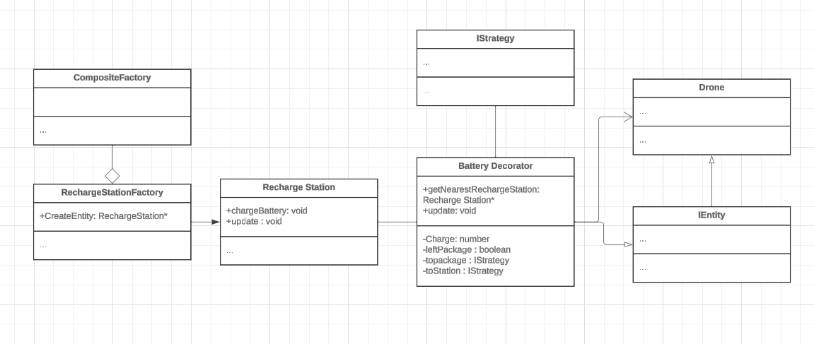

# HW4 - New Feature Extension

| Team 27 Member Name | x500                                        |
| ------------------- | ------------------------------------------- |
| Emmett O'Donnell    | [odonn159@umn.edu](mailto:odonn159@umn.edu) |
| Nels Parenteau      | [paren208@umn.edu](mailto:paren208@umn.edu) |

## Running the Simulation

There are several ways to run and build the simulation.

### Makefile

If you are on a linux machine, or have other ways of using the makefile we have provided, you are welcome to do so.

Building the project:

```bash
$ make -j
```

Running the project:

```bash
make run
```

Or,

```bash
$ ./build/bin/transit_service <port> apps/transit_service/web/
```

If the web browser does not open automatically, make sure you open it with the link: `https://localhost:<port>`

Otherwise,

### Dockerfile

If you are familiar with Docker, we have provided a dockerfile to use.
You can pull our docker file from the repository [Here](https://hub.docker.com/repository/docker/spambot3737/paren208-odonn159-hw4/general)

-   Use the command

```bash
$ docker pull -a spambot3737/paren208-odonn159-hw4
```

-   then run

```bash
$ docker run --rm -it -p 8081:8081 spambot3737/paren208-odonn159-hw4
```

This should launch the simulation at localhost:8081. (If 8081 is currently being used by another program, you can change it to another valid port.)

Should you wish to create your own docker image, perform the following commands.

-   For building the simulation container

```bash
$ docker builds -t <image_name> .
```

-   For running the built container

```bash
$ docker run --rm -it -p 8081:8081 <image_name>
```

By default, the port number is 8081. If you want to use a different port number you are welcome to do so.

## Project Description

### Overview

The project is a package delivery simulation. A user can request, in a web interface, a package's spawn point, the package's delivery point, the receiver's name, and the algorithm in which the package will be delivered. Then the user may view on the web, a 3d model of the University of Minnesota's campus, and watch a drone go to the package, pick it up, and deliver it to the requester.

### The Players: IEntity and its Subclasses

IEntity is a pure virtual class that contains attributes that one would expect from a physical object, position, direction, name, color, speed, and an ID. It also contains the simulation model it is operating under, and the JSON details that assigns the previous attributes.

-   **Battery** This is a decorator object for the drone, it is a new feature for HW4. It most function calls to its decorated drone object, a major caveat being the update function. It has a charge level that corresponds to the amount of distance the drone can travel. In other words if the battery has a charge of 300 left, the drone can move 300 units in any direction before dying. If the distance to the nearest recharge station is approaching the amount of distance the drone has left in its battery, it will stop what it is doing, and get a recharge. After its battery is full, it returns to its task if it had one.

-   **Drone** This is the most complicated subclass of IEntity. Every tick of the simulation the Drone, if available(no current package to deliver), checks if there is a package that needs a delivery, and if so, creates a routing strategy to go to the package and then to the robot. If it has a routing strategy, the drone uses its move method to move it. If the drone has a package, the movement step will also move the package's location, using the same move method.

-   **Helicopter** This object picks a random point in the sky and moves to directly to it. When it gets to its destination, it picks a new random location.

-   **Human** This object picks a random point on the surface, and routes to it. When it gets to its destination, it picks a new random location.

-   **Package** This is an object that cannot move. It has a destination and a routing strategy that the drone will use. It is created in tandem with a robot, and gets picked up by a Drone finds a route with the strategy, and delivers to the Robot in question.

-   **Recharge Station** This is another one of the new features for HW4. This object does not move on its own. If requested, it can charge batteries if the battery is within 5 units of the drone.

-   **Robot** This is an object that cannot move. It receives the package that it was created with. When the pair is created, the drone routes to the package and then routes to the robot with the package.

### The Board: SimulationModel

This class is the brains of the simulation. It adds, removes, and updates the entities above; schedules deliveries; and holds the graph of the roads.

-   **Creation** The simulation model creates entities using a factory pattern using the CompositeFactory class. CompositeFactory is a class that is fed a list of factories for each entity, e.g. DroneFactory, PackageFactory. When creation details are sent to the simulation, it checks each to see if any factory accepts those instructions. In detail, if the input JSON object's type matches a factory's type, that factory will make a entity of that JSON objects description.

-   **Deletion** The simulation model handles deletion simply: it can takes an id, and removes the corresponding object from its list of entities.

-   **Updating** For each tick, the simulation runs the update method on each entity.

-   **Scheduling** This is a part of the creation of objects, if a package is created, the simulation will append the package to it's scheduling queue. Then if a drone is available the drone will check this queue and take the first package in line.

### The Action: PathStrategy and its Subclasses

PathStrategy is what allows objects to move, and routes them correctly in the graph of roads. First the graph is a collection of nodes, usually intersections, and vertices between them, usually roads. Then a route created by a subclass of PathStrategy is ordered list of vertices that connects point A to point B. The way that our subclass does so it based on the algorithm it applies: Beeline (A straight shot from point A to B), breadth first search, depth first search, and A\*. PathStrategy also dictates the movement of objects.

-   **Movement** PathStrategy keeps track of a ordered list of points. They will be sequentially moved through, as the object moves through the list, it constantly has a next point to travel to, lets call it `next`. The movement step uses the objects current position, `current`, the objects speed, `speed`, and the length of the tick `dt`, the objects next position uses this equation, where `unit()` normalizes the input vector:

    ```JS
    current = unit(next - current) * speed * dt
    ```

    Once it is within 4 units of `next` it selects the subsequent node to be `next`. When it reaches the final node, it is considered complete.

There are also 2 decorator subclasses of PathStrategy. They defer all movement to their decorated class until the decorated class is completed. We use our decorator classes to do a celebration when we are finished with the path. An example is when a drone is given the depth first search strategy, that strategy is given both decorators Spin then Jump. When the package is delivered, the Jump class notices that its decorated class, depth first search, is finished and it does 4 consecutive jumps and then marks itself as done. Then the Spin class is decorating Jump and notices that Jump is completed and does 2 full spins. When drone's PathStrategy checks if it is complete, it checks whether Spin has finished, and it has, so the drone can do other tasks.

## New Feature : Battery implementation

For our HW4 extension we decided to implement a battery decorator for the drone, requiring it to use energy to move and while idle.

**What does it do?**

Our extension adds the necessity of energy to each drone created. Each drone has a set amount of charge that diminishes over time, and while it moves. As a result, it needs to determine when it does not have enough energy to continue doing it's job, it can return to a recharging station (Placed around the UMN campus).

**Why is it significantly interesting?**

The primary goal of most simulations is to demonstrate a real world situation. While we may choose to simplify certain aspects, an unrealistic simulation is not particularly useful. By implementing the requirement for drones to not only use recharging stations, but to calculate when they need to recharge serves to make the simulation more closely resemble real world business applications.

**How does it add to the existing work?**

The existing simulation already made use of path strategies and time intervals. It adds a simple decorator wrapper that contains new logic to follow when certain conditions are met, and new properties of current charge level, and the ability to determine the nearest charging station. While idle or moving, the battery loses power. When update is called, it determines the amount of battery lost, and which decision it makes, which can be divided into several situations.

1. If there are no issues, it uses the standard drone logic, following the movement patterns of the drone, or the package it carries.
2. If the drone determines it is at risk of running out of power before making it to the next recharge station, it will drop any packages it is carrying and beeline towards a recharge station.
3. Once the drone reaches the recharge station it waits until it is fully charged, at which point, if it left a package behind it will go pick it up and finish it's delivery. Otherwise, it will return to following the standard drone logic.

**Which design pattern did you choose to implement it and why?**

We chose to implement a decorator. The BatteryDecorator class wraps around each drone, granting them new logic, and a few new attributes. This is easiest because it follows the most crucial aspects of SOLID design philosophy, where the drone is closed to modification, but open to extension. It also has the convenient effect of being entirely optional, and turning off our battery decorators and recharge stations would take less than a minute. This would not be the case if we hard coded the information directly into the existing drone class. Lastly, we think it is useful for preserving all of the information that is held within a drone and package object. By simply adding additional strategies and contingencies, we never lose which strategy or information the original package was supposed to perform.

**Instruction to use this new feature**

This feature is automatically used when starting the simulation (as described above.)

### Sprint Retrospective

While we had intended the standard 2 sprints of two weeks, things got messy pretty quickly. Due to prior engagements and physical ailments, most of the project was completed in the final week of development.

### UML DESIGN

<p align="center"> </p>
